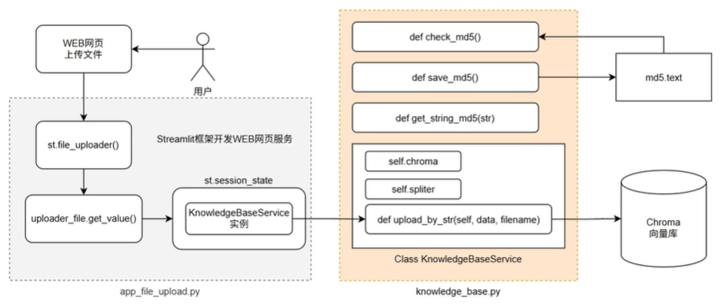

# RAG项目案例一

 ## 基于 **Streamlit** 的本地知识库上传与**RAG**问答学习项目
适合作为本地知识库问答与 RAG 检索增强的入门实践
- 在网页端上传 `txt` 文件，自动切分后写入 Chroma 向量库
- 在网页端以聊天形式提问，基于知识库内容进行检索增强回答（RAG） 
- 支持 会话历史查看，流式思维链输出
- 技术栈：Python / Streamlit / LangChain / Chroma / Embeddings / Qwen ChatModel

---

## （一）
<p align="center">
  
  项目主要实现代码图
</p>

## （二）
<p align="center">
  
  基于Streamlit框架开发结构图
</p>

## （三）
<p align="center">
  
  在线流程开发结构图
</p>

## 🧩 项目结构

```text
KnowledgeBase-RAG-LLM-System/
├─ app_upload.py              # 知识库上传服务（Streamlit）
├─ app_chat.py                # 智能客服问答（Streamlit）
├─ knowledge_base.py          # 知识库处理：读取、切分、写库、去重
├─ rag.py                     # RAG 链组装
├─ vector_stores.py           # 向量库检索封装（持久化）
├─ file_history_store.py      # 会话历史存储
├─ config_data.py             # 模型、路径、chunk 等参数配置
└─ pic/                       # README 演示图片与示例素材文本所在
```

参考代码地址：
#### (一)
https://github.com/lhh737/KnowledgeBase-RAG-LLM-System
#### (二)
https://github.com/spidermanismela/RAG-program/tree/main
#### (三)
https://github.com/yichunfu5-prog/langchain-rag-agent
#### 面试八股文
https://my.feishu.cn/wiki/ChJkwfEo5iGpdXkL5oBcflRvn4g
#### 学习资料
https://github.com/limouren2000/llms-dev-study
https://github.com/wdndev/llm_interview_note
https://wdndev.github.io/llm_interview_note/#/
